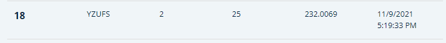
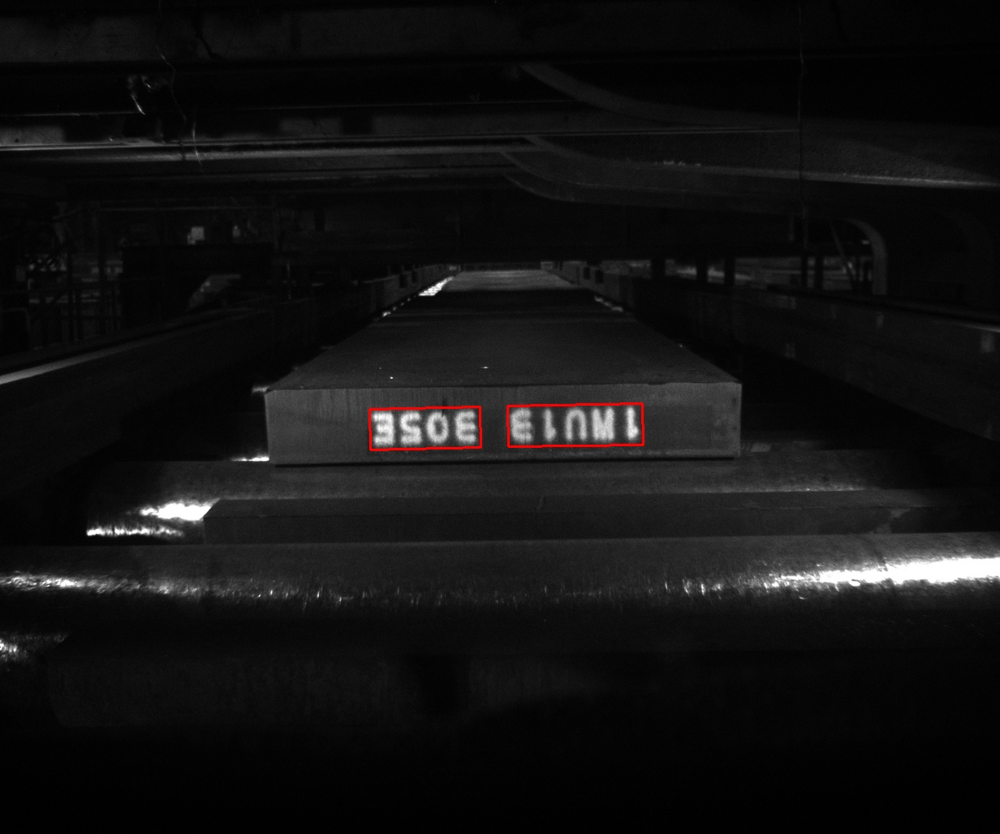
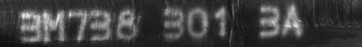
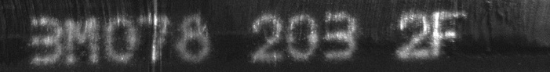

# TBrain_China Steel AI Challenge
Participants must develop an AI algorithm to recognize printed or handwritten serial numbers on steel billets. This will aid in tracing issues and quality control. The system should identify printed serial numbers (digits and letters) and handle handwritten, inverted, duplicated, or blurred serial numbers for production line use.  

## Preparation and Process

This repository refers to [CRAFT](https://github.com/clovaai/CRAFT-pytorch).
1. Using [this repository](https://github.com/Depth-Semantic-Aware-Image-Generation/TBrain_China-Steel-AI-Challenge) to add some randomness while framing the input steel billet image with text areas.
2. Then use [deep-text-recognition-benchmark](https://github.com/clovaai/deep-text-recognition-benchmark) to recognize the text in the framed steel billet image.

## Code and folder description

- **test.py**:  
  Use the weights provided by the official CRAFT for prediction.
- **cut_code.py & cut_code2**:  
  Apply cutting methods with different randomness to the selected bounding box.
- **image folder**:  
  Images pending processing.
- **start folder**:  
  Images with bounding boxes awaiting cutting after running test.py.  
- **end folder**:  
  Images after being cut using randomized cutting methods.
